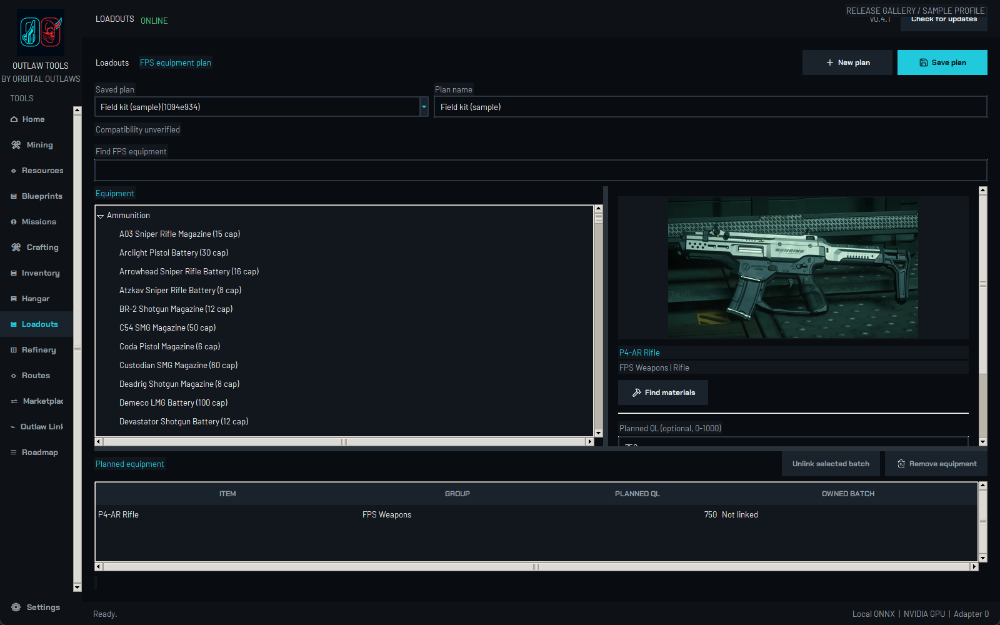
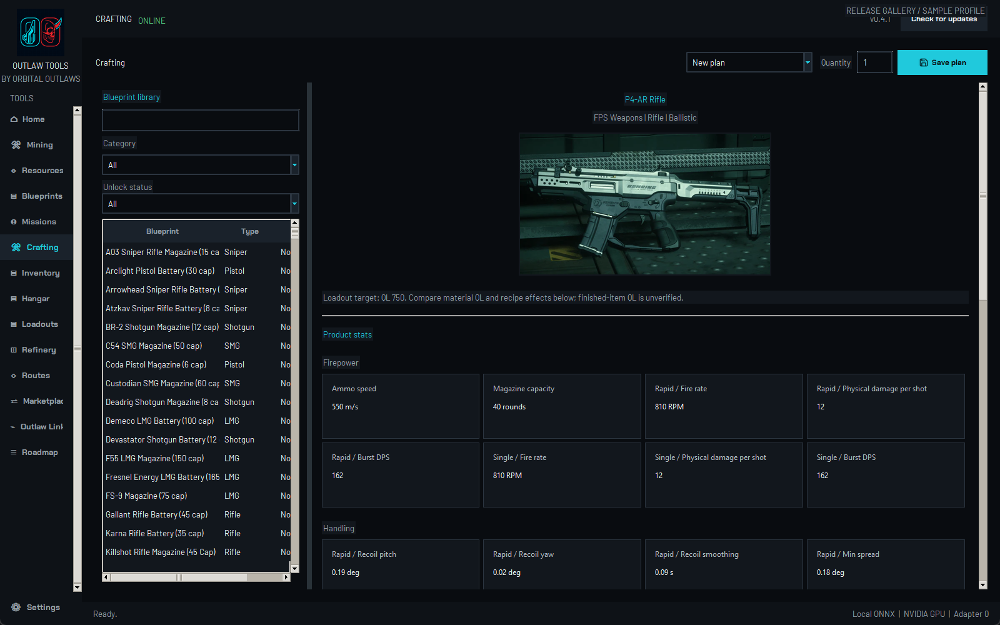
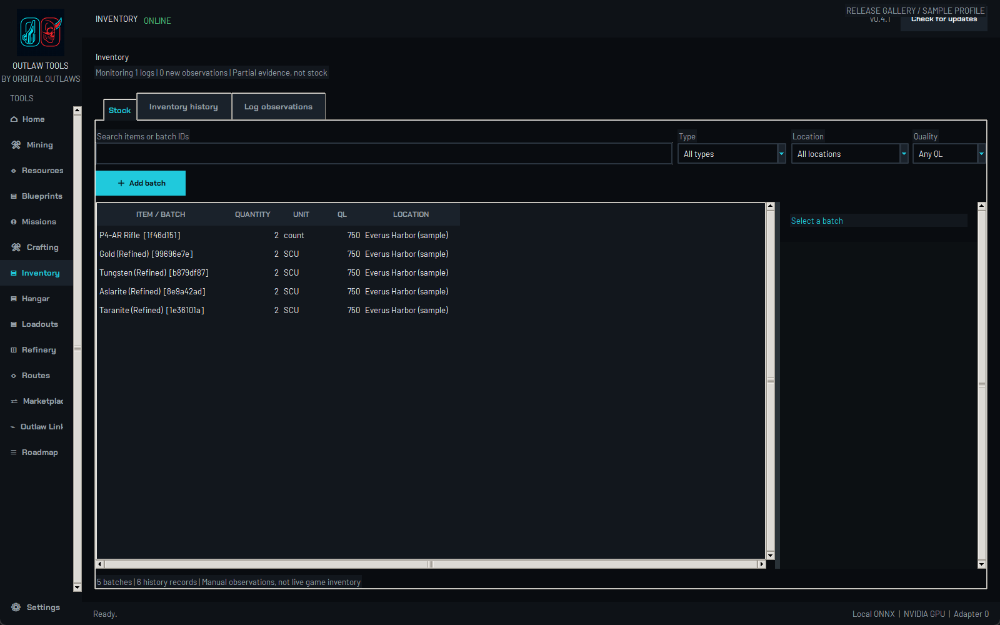
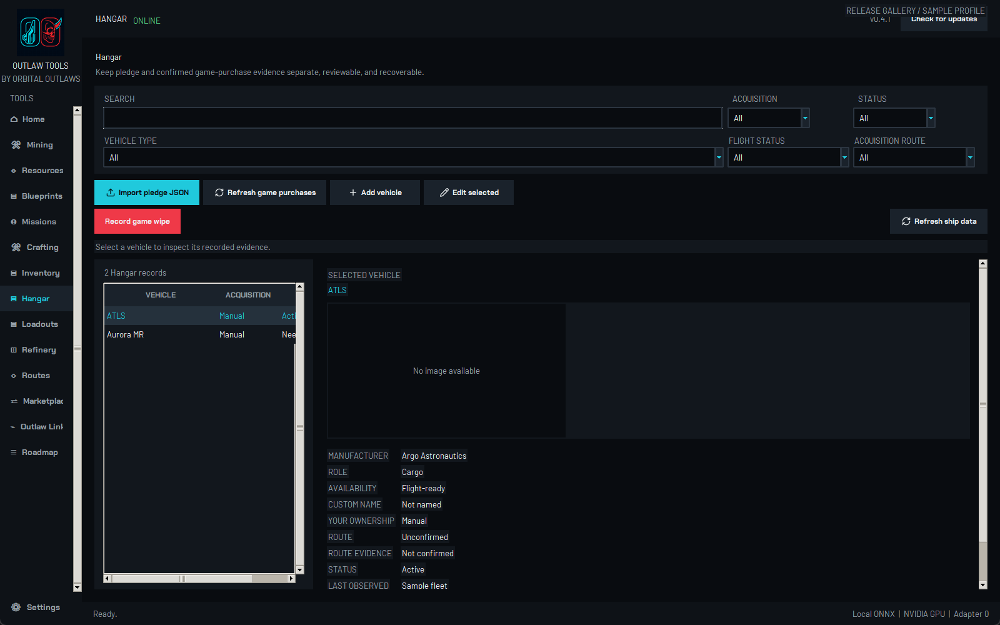
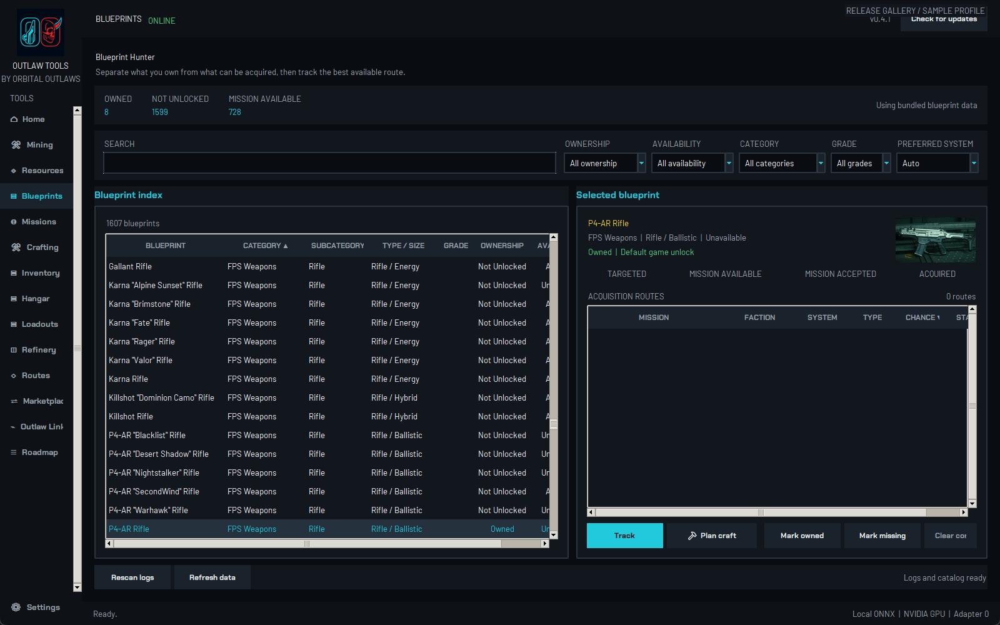
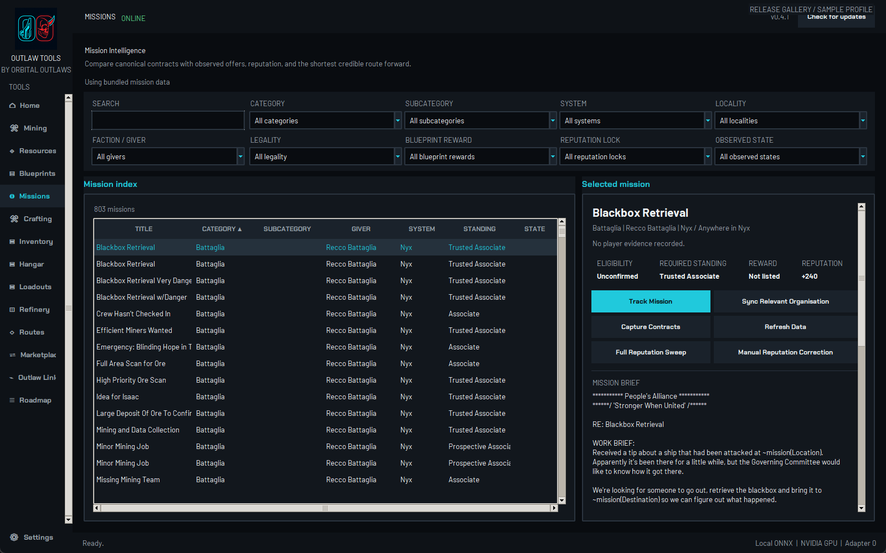
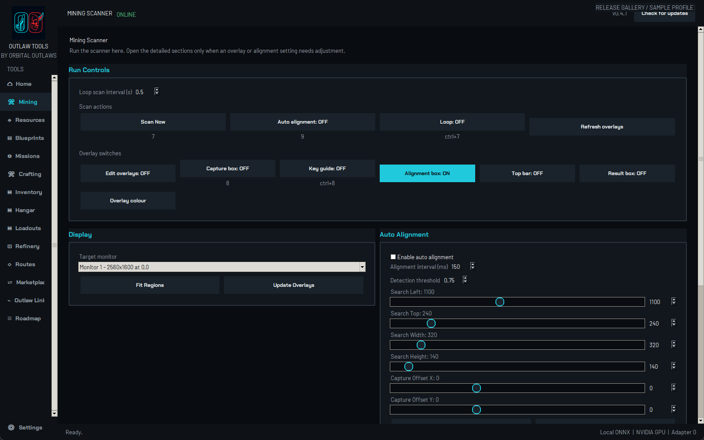
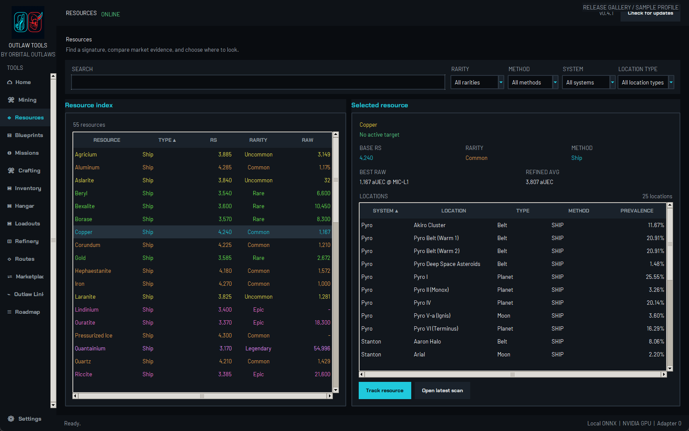
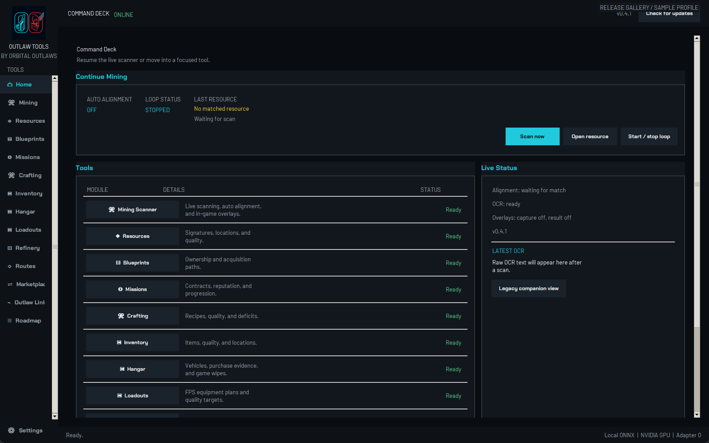

# Outlaw Tools

Public release downloads for **Outlaw Tools**, the Orbital Outlaws desktop companion for Star Citizen.

- Canonical product page: https://www.orbitaloutlaws.tv/tools
- Features and roadmap: https://www.orbitaloutlaws.tv/tools#features and https://www.orbitaloutlaws.tv/tools#roadmap
- Releases: https://github.com/PattrnData/Outlaw-Tools-Releases/releases

The source repository remains private. This repository is only for public release notes, installers, Linux packages, and checksum assets.

## Current release

- Latest release: https://github.com/PattrnData/Outlaw-Tools-Releases/releases/latest
- Windows: https://github.com/PattrnData/Outlaw-Tools-Releases/releases/latest/download/OutlawTools-Setup.exe
- Linux: https://github.com/PattrnData/Outlaw-Tools-Releases/releases/latest/download/OutlawTools-linux-x86_64.tar.gz

Windows installs to `C:\Program Files\Orbital Outlaws\Outlaw Tools` by default. On Linux, extract the package and run `./install.sh` to install to `/opt/outlaw-tools`. Both add application-menu shortcuts. Python and Git are not required; GPU drivers are required for OCR.

## Feature Gallery

Actual v0.4.1 native-app captures using synthetic demonstration records, not private player data. Download availability is determined by the published releases above.

### Loadouts

Save FPS equipment plans, link recorded inventory batches and open material planning. Planned item QL and owned batch QL stay separate. Dynamic slots, compatibility validation, nested attachments and ship fitting remain planned.

### Crafting

Resource-quality controls, item-stat estimates and inventory allocations with recorded locations and shortages. Plans do not consume stock or guarantee finished-item QL.

### Inventory

Record quantities, QL and locations, compare snapshots and review continuously monitored game-log observations. Logs provide partial evidence, not complete inventory or automatic stock updates.

### Hangar

Pledge JSON imports, confirmed purchase evidence and manual vehicles. Flight-ready availability is separate from your ownership record.

### Blueprints and Missions

Blueprint discovery, unlock evidence, mission rewards and reputation routes.

### Mining and Resources

GPU OCR, adjustable overlays and resource/location reference data.

### Home

## Privacy and Scope

Personal fleet, inventory and log files stay on your PC. The screenshots use a disposable sample profile; sample player data is not bundled with the app. Outlaw Tools does not request RSI passwords, access browser cookies or automate game input. The packaged llama.cpp runtime remains dormant, without a model or background process.

This public repository contains downloads, release documentation and approved feature images only. Source stays private. Credits and data-provider links are in **Settings > About & Credits**.

This is an unofficial fan-made application, not affiliated with or endorsed by Cloud Imperium Games or Roberts Space Industries. Star Citizen and related marks belong to their respective owners.
